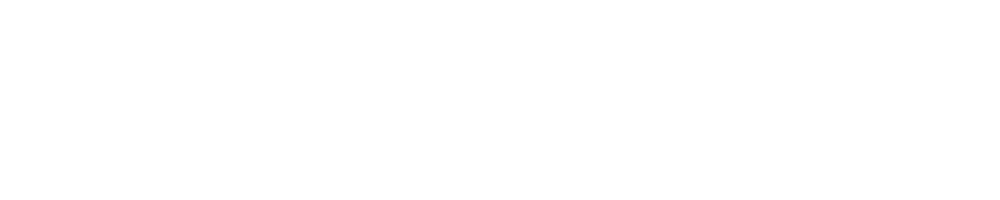

sysc-greet is a graphical console greeter for greetd, written in Go with the Bubble Tea framework.


## Features

- **Multiple Themes**: Dracula, Gruvbox, Material, Nord, Tokyo Night, Catppuccin, Solarized, Monochrome, TransIsHardJob, Eldritch, RAMA, Dark (plus custom themes)
- **Background Effects**: Fire (DOOM PSX), Matrix rain, ASCII rain, Fireworks, Aquarium
- **ASCII Effects**: Typewriter, Print, Beams, and Pour effects for session text
- **Border Styles**: Classic, Modern, Minimal, ASCII-1, ASCII-2, Wave, Pulse
- **Screensaver**: Configurable idle timeout with ASCII art cycling
- **Video Wallpapers**: Multi-monitor support via gSlapper
- **Security Features**: Failed attempt counter with account lockout warnings, optional username caching

## Installation

### Quick Install Script

One-line install for most systems:

```bash
curl -fsSL https://raw.githubusercontent.com/Nomadcxx/sysc-greet/master/install.sh | sudo bash
```

### Manual Build

The installer lets you choose your compositor and handles all configuration:

```bash
git clone https://github.com/Nomadcxx/sysc-greet
cd sysc-greet
go run ./cmd/installer/
```

### Arch Linux (AUR)

sysc-greet provides three AUR packages for different compositors:

```bash
# Recommended (niri)
yay -S sysc-greet

# Hyprland variant
yay -S sysc-greet-hyprland

# Sway variant
yay -S sysc-greet-sway
```

### NixOS (Flake)

Add sysc-greet to your NixOS configuration using the flake:

**flake.nix:**
```nix
{
  inputs = {
    nixpkgs.url = "github:NixOS/nixpkgs/nixos-unstable";
    sysc-greet = {
      url = "github:Nomadcxx/sysc-greet";
      inputs.nixpkgs.follows = "nixpkgs";
    };
  };

  outputs = { self, nixpkgs, sysc-greet, ... }: {
    nixosConfigurations.your-hostname = nixpkgs.lib.nixosSystem {
      system = "x86_64-linux";
      modules = [
        ./configuration.nix
        sysc-greet.nixosModules.default
      ];
    };
  };
}
```

**configuration.nix:**
```nix
{
  services.sysc-greet = {
    enable = true;
    compositor = "niri";  # or "hyprland" or "sway"
  };

  # Optional: Set initial session for auto-login
  services.sysc-greet.settings.initial_session = {
    command = "Hyprland";
    user = "your-username";
  };
}
```

Then rebuild your system:
```bash
sudo nixos-rebuild switch --flake .#your-hostname
```

### Advanced: Manual Build from Source

**Requirements:**
- Go 1.25+
- greetd
- Wayland compositor (niri, hyprland, or sway)
- kitty (terminal)
- gSlapper (wallpaper daemon)
- swww (legacy wallpaper daemon, optional fallback)

**Build and install:**

```bash
git clone https://github.com/Nomadcxx/sysc-greet
cd sysc-greet
go build -o sysc-greet ./cmd/sysc-greet/
sudo install -Dm755 sysc-greet /usr/local/bin/sysc-greet
```

**Install assets:**

```bash
sudo mkdir -p /usr/share/sysc-greet/{ascii_configs,fonts,wallpapers}
sudo cp -r ascii_configs/* /usr/share/sysc-greet/ascii_configs/
sudo cp -r fonts/* /usr/share/sysc-greet/fonts/
sudo cp -r wallpapers/* /usr/share/sysc-greet/wallpapers/
sudo cp config/kitty-greeter.conf /etc/greetd/kitty.conf
```

**Configure greetd** (`/etc/greetd/config.toml`):

Choose your compositor and update the command below:

```toml
[terminal]
vt = 1

[default_session]
# Pick one:
command = "niri -c /etc/greetd/niri-greeter-config.kdl"
# command = "start-hyprland -- -c /etc/greetd/hyprland-greeter-config.conf"
# command = "sway --unsupported-gpu -c /etc/greetd/sway-greeter-config"
user = "greeter"
```

**Create compositor config:**

Copy the appropriate config file to `/etc/greetd/`:

```bash
# For niri:
sudo cp config/niri-greeter-config.kdl /etc/greetd/

# For hyprland:
sudo cp config/hyprland-greeter-config.conf /etc/greetd/

# For sway:
sudo cp config/sway-greeter-config /etc/greetd/
```

**Create greeter user:**

```bash
sudo useradd -M -G video -s /usr/bin/nologin greeter
sudo mkdir -p /var/cache/sysc-greet /var/lib/greeter/Pictures/wallpapers
sudo chown -R greeter:greeter /var/cache/sysc-greet /var/lib/greeter
sudo chmod 755 /var/lib/greeter
```

**Enable service:**

```bash
sudo systemctl enable greetd.service
```

## Usage

### Key Bindings

- **F1** - Settings menu (themes, borders, backgrounds)
- **F2** - Session selection
- **F3** - Release notes
- **F4** - Power menu (shutdown/reboot)
- **Page Up/Down** - Cycle ASCII variants
- **Tab** - Navigate fields
- **Enter** - Submit/Continue
- **Esc** - Cancel/Return to previous screen

### Test Mode

Test the greeter without locking your session:

```bash
sysc-greet --test

# Test in fullscreen (recommended for accurate preview)
kitty --start-as=fullscreen sysc-greet --test
```

### Additional Options

```bash
sysc-greet --theme dracula          # Start with specific theme
sysc-greet --screensaver            # Enable screensaver in test mode
sysc-greet --remember-username      # Cache username across sessions
sysc-greet --debug                  # Enable debug logging
sysc-greet --version                # Show version information
```

## Configuration

sysc-greet stores user preferences in `/var/cache/sysc-greet/`. The following settings are cached:

- **Theme** - Selected color theme
- **Background** - Selected background effect or video wallpaper
- **Border Style** - Selected border style
- **Session** - Last selected session
- **Username** - Last entered username (if `--remember-username` enabled)
- **ASCII Index** - Last selected ASCII variant

### Themes

sysc-greet includes multiple built-in themes:

| Theme | Primary Color | Description |
|--------|--------------|-------------|
| Dracula | #bd93f9 | Dark purple-blue theme |
| Gruvbox | #fe8019 | Warm dark theme |
| Material | #80cbc4 | Material Design dark theme |
| Nord | #81a1c1 | Arctic blue-toned dark theme |
| Tokyo Night | #7aa2f7 | Modern dark theme |
| Catppuccin | #cba6f7 | Soft pastel dark theme |
| Solarized | #268bd2 | Solarized dark theme |
| Monochrome | #ffffff | Black and white minimal theme |
| TransIsHardJob | #5BCEFA | Transgender flag colors |
| Eldritch | #37f499 | Purple and green theme |
| RAMA | #ef233c | RAMA keyboard aesthetics |
| Dark | #ffffff | True black and white minimal theme |

Custom themes can be added via TOML files in `/usr/share/sysc-greet/themes/` or `~/.config/sysc-greet/themes/`. See [Themes Configuration](configuration/themes.md) for details.

### Background Effects

sysc-greet supports several background effects:

- **Fire** - DOOM PSX fire effect
- **Matrix** - Matrix rain effect
- **ASCII Rain** - Falling ASCII characters
- **Fireworks** - Firework explosions
- **Aquarium** - Swimming fish animation

### Wallpapers

sysc-greet supports two types of wallpapers:

1. **Themed Wallpapers** - Static images that match selected theme (stored in `/usr/share/sysc-greet/wallpapers/`)
2. **Video Wallpapers** - Video backgrounds managed by gSlapper (stored in `/var/lib/greeter/Pictures/wallpapers/`)

For detailed configuration, see [Wallpapers Feature](features/wallpapers.md).

### ASCII Art

Each session can have custom ASCII art with multiple variants. Press `Page Up/Down` at the greeter to cycle through variants.

ASCII art configurations are stored in `/usr/share/sysc-greet/ascii_configs/`. Each session has a `.conf` file containing:

- `name` - Display name for the session
- `ascii_1`, `ascii_2`, etc. - Multiple ASCII art variants
- `colors` - Optional hex colors for rainbow effect
- `roasts` - Custom roast messages separated by `│` character

For more details, see [ASCII Art Feature](features/ascii-art.md).

### Screensaver

The screensaver activates after a configurable idle timeout and displays:

- Current time and date
- ASCII art cycling
- Optional print animation effect

Screensaver configuration is in `/usr/share/sysc-greet/ascii_configs/screensaver.conf`.

### Compositor Setup

sysc-greet works with niri, Hyprland, and Sway compositors. For detailed setup instructions, see:

- [Niri Setup](compositors/niri.md)
- [Hyprland Setup](compositors/hyprland.md)
- [Sway Setup](compositors/sway.md)

## Development

### Building

```bash
make build
```

### Testing

```bash
make test
```

### Running in Test Mode

```bash
./sysc-greet --test --debug
```

For development details, see [Development Guide](development/architecture.md).

## Troubleshooting

**Greeter won't start:**
```bash
sudo systemctl status greetd
journalctl -u greetd -n 50
```

**Check gSlapper status:**
```bash
# Check if gSlapper is running
ps aux | grep gslapper

# View gSlapper debug log
cat /tmp/sysc-greet-wallpaper.log
```

**Debug logging:**
```bash
# Run with debug flag
sysc-greet --debug

# View debug log
cat /tmp/sysc-greet-debug.log
```

For more troubleshooting, see [Troubleshooting Guide](getting-started/troubleshooting.md).

## Related Projects

If you like ASCII animations, CLI and TUI terminal aesthetics check out these projects:

- [sysc-Go](https://github.com/Nomadcxx/sysc-Go) - Terminal animation library for Go
- [sysc-walls](https://github.com/Nomadcxx/sysc-walls) - Terminal-based screensaver for Wayland/X11
- [gSlapper](https://github.com/Nomadcxx/gSlapper) - Video wallpaper manager for Wayland

## Acknowledgments

- [tuigreet](https://github.com/apognu/tuigreet) by apognu - Original inspiration and base
- [Bubble Tea](https://github.com/charmbracelet/bubbletea) by Charm - TUI framework
- [Lipgloss](https://github.com/charmbracelet/lipgloss) by Charm - Terminal styling
- [greetd](https://git.sr.ht/~kennylevinsen/greetd) by kennylevinsen - Login manager

## License

MIT
